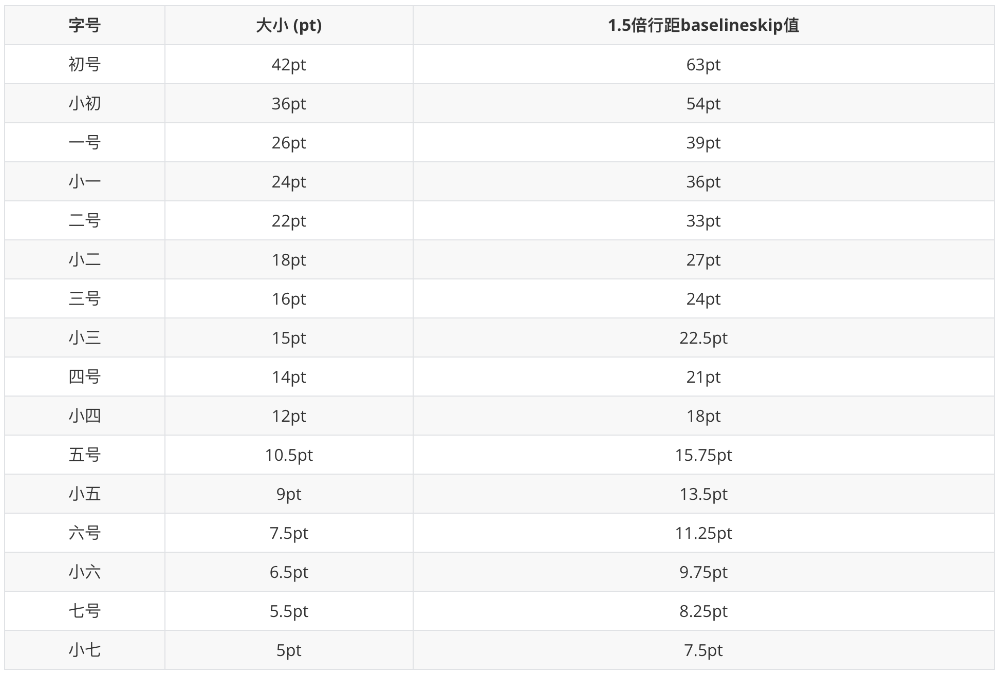

在学习Latex体系的庞大和定义之多，相对于我们来讲，我们只是把Latex当做一种工具，一种写文章的工具，不需要所有的内容都有所了解，只需要你要用的、经常用的那一块内容熟练掌握就可以。

抱着这样的心态去学习Latex语言，会轻松很多，就不会觉得好难，并且效率高，不会为之浪费过多不必要的时间。

所以我推荐的一个Latex学习流程就是，先了解Latex的大致工作原理，再熟悉一下Latex的文章结构，最后边自己编写文章，边学习自己需要的东西。

以下是极度洁简的一个模板，基本上可以写东西了。

```latex
\documentclass{article}
\usepackage{xeCJK}       %支持中文的宏包
\title{this is a title}
\author{xxx}
\usepackage[top=1in, bottom=1in, left=1.25in, right=1.25in]{geometry}
%页面基础设置，页边距
\pagenumbering{roman}
%设置页码的编号样式
```

---

#### 页面选择

在写latex文档的时候，我们可以选择不同的文档样式，通用的一般为article，通过以下代码设置页面大小与字体。修改字体用`fontspec`包。

```latex
\documentclass[11pt,a4paper]{article}
```

---

#### 字体设置

##### 样式设置

```latex
\bf             % 罗马族，直立形状，黑体系列
\it             % 罗马族，斜体形状，中等粗细系列
\rm             % 罗马族，直立形状，中等粗细系列，默认的字体
\sc             % 罗马族，小型大写形状，中等粗细
\sf             % 无衬线族，直立形状，中等粗细
\sl             % 罗马族，slanted的斜体形状，中等粗细系列
\tt             % 打字机族，直立形状，中等粗细
\em             % 强调字体，它与当前字体同族、同系列，但形状不同
\emph           % 用强调字体打印文本，它与当前字体同族、同系列，但形状不同
```

上面的命令是针对全局的声明命令，要对局部使用`{\bf}` 语句。

```latex
normalfont     % 把字体转换为默认的族、形状和系列
bfseries       % 不改变当前字体的族与形状，但转变成bold序列
mdseries       % 不改变当前字体的族与形状，但转变成中等粗细medium序列
itshape        % 把字体的形状属性改为斜体，但保留族与系列不变
scshape        % 把字体的形状属性改为小型大写，但保留族与系列不变
slshape        % 把字体的形状属性改为slanted的斜体，但保留族与系列不变
upshape        % 把字体的形状属性改为直立，但保留族与系列不变
rmfamily       % 使字体保持当前的系列与形状属性，但转变为罗马族
sffamily       % 使字体保持当前的系列与形状属性，但转变为无衬线族
ttfamily       % 使字体保持当前的系列与形状属性，但转变为打字机族
```

上面的命令同样也是全局的。

```latex
\mathbf{}         % 数学模式里用粗体打印文本，空格被忽略
\mathit{}         % 数学模式里用斜体打印文本
\mathsf{}         % 数学模式里用无衬线字体（sffamily）打印文本，其中的空格被忽略
\mathtt{}         % 数学模式里用打印机字体（ttfamily）打印文本，其中的空格被忽略
```

```latex
\textbf{}         % bfseries 不改变当前字体的族与形状，但转变成bold序列
\textit{}         % itshape 把字体的形状属性改为斜体，但保留族与系列不变
\textmd{}         % mdseries 不改变当前字体的族与形状，但转变成中等粗细medium序列 
\textrm{}         % rmfamily 使字体保持当前的系列与形状属性，但转变为罗马族 
\textsc{}         % scshape 把字体的形状属性改为小型大写，但保留族与系列不变
\textsf{}         % sffamily 使字体保持当前的系列与形状属性，但转变为无衬线族
\textsl{}         % slshape 把字体的形状属性改为slanted的斜体，但保留族与系列不变
\texttt{}         % ttfamily 使字体保持当前的系列与形状属性，但转变为打字机族
\textup{}         % upshape 把字体的形状属性改为直立，但保留族与系列不变
\underline{}      % 加下划线
```

> 值得注意的是，`\bf` 这类针对全局的命令是不可以同时使用的，也就说，后面的命令会刷新前面的命令。如果你要设置诸如加粗又要倾斜的字体，就得配合`\textbf` 来使用了。注意这两种语句的使用方式是不一样的。但还有一个问题就是，数学公式当中`\bf` 系列的语句没有作用，且数学公式中使用`\textbf` 的效果是一样的。

要打数学粗体，使用如下代码

```latex
\usepackage{bm}
...
\bm{}
```

##### 字号设置

###### LaTeX默认命令

使用latex默认命令能够满足我们日常的生活学习需要，写一些不是那么正式的文档时，使用起来方便快捷。

```
\tiny
\scriptsize
\footnotesize
\small 
\normalsize
\large
\Large
\LARGE
\huge
\Huge  
```

###### `fontsize{字号}{行距}`命令

通过`fontsize{字号}{行距}`命令来定义字体的大小，似乎不用添加任何包就可以正常使用，需要注意的是, 这个命令对其后所有文本都起作用，在使用此命令后需要用 `\selectfont`才能使字体大小设置起作用。

在中文环境下, 通常会遇到”正文使用小四, 宋体”这样的规定, 但是LaTeX并没 有小四, 只有pt. 下面是字号对应的转换表:

```{r, echo=FALSE, out.width="100%", fig.align="center"}

```

按照上表，`\fontsize{12pt}{24pt}\selectfont` 表示的是设置小四大小的字体，并且行距是两倍行距。后面的`{}` 里面设置的是行距。

但要局部修改字体时，使用`{\fontsize{12pt}{24pt}\selectfont 文本}` 即可。

另外一个非常伟大的功能就是，我们可以自定义命令放在导言区，这样我们要使用相应的命令就非常简单和快捷了，如下所示的自定义命令：

```latex
\newcommand{\yihao}{\fontsize{26pt}{36pt}\selectfont}        % 一号, 1.4 倍行距
\newcommand{\erhao}{\fontsize{22pt}{28pt}\selectfont}        % 二号, 1.25倍行距
\newcommand{\xiaoer}{\fontsize{18pt}{18pt}\selectfont}       % 小二, 单倍行距
\newcommand{\sanhao}{\fontsize{16pt}{24pt}\selectfont}       % 三号, 1.5倍行距
\newcommand{\xiaosan}{\fontsize{15pt}{22pt}\selectfont}      % 小三, 1.5倍行距
\newcommand{\sihao}{\fontsize{14pt}{21pt}\selectfont}        % 四号, 1.5 倍行距
\newcommand{\banxiaosi}{\fontsize{13pt}{19.5pt}\selectfont}  % 半小四, 1.5倍行距
\newcommand{\xiaosi}{\fontsize{12pt}{24pt}\selectfont}       % 小四, 2倍行距
\newcommand{\dawuhao}{\fontsize{11pt}{11pt}\selectfont}      % 大五号, 单倍行距
\newcommand{\wuhao}{\fontsize{10.5pt}{15.75pt}\selectfont}   % 五号, 单倍行距
```

值得注意的是使用上面的命令，如`\yihao` 同样也会是对接下来的全局有效，要使用局部的话使用命令`{\yihao 文本}` 即可。

##### 设置不同的字体

使用如下的命令，分别来修改中文字体和英文字体，注意下面的命令只放在导言区有效：

```latex
\usepackage{fontspec}
\setmainfont{Times New Roman} 
\setCJKmainfont{Microsoft YaHei}
```

常见的中文字体名称有以下几种：

```latex
STCaiyun,华文彩云
YouYuan,幼圆
STHupo,华文琥珀
FZYaoTi,方正姚体
NSimSun,新宋体
FangSong,仿宋
KaiTi,楷体
Microsoft YaHei,微软雅黑
SimSun,宋体
STFangsong,华文仿宋
STXinwei,华文新魏
STXingkai,华文行楷
STLiti,华文隶书
SimHei,黑体
STZhongsong,华文中宋
Microsoft YaHei,微软雅黑
FZShuTi,方正舒体
STXihei,华文细黑
LiSu,隶书
STKaiti,华文楷体
```

参数输入中英文都可以。也可以使用自定义字体名称的命令：

```latex
\newcommand{\tempus}{\fontspec Tempus Sans ITC}
\newcommand{\kt}{\CJKfontspec{楷体}}%用命令\fzkaiti调用楷体
```

在文中调用字体时采用如下命令（下面的是全局命令，要局部方法同上）：

```latex
\CJKfontspec{楷体}       %针对中文字体设置
\fontspec{Consolas}     %针对英文字体设置
```

---

#### 文章结构

`\part`： 部，深度：-1，不能用在`letter`；

`\chapter`：章，深度：0，可以用在`book`和`report`；

`\section`：节，深度：1，不能用在`letter`;

`\subsection`：小节，深度：2， 不能用在`letter`;

`\subsubsection`：小小节，深度：3，不能用在`letter`;

`\paragraph`：带标题的段落（用`{ }`），深度：5，不能用在`letter`; 

`\subparagraph`：带标题的次级段落（用`{ }`），深度：6，不能用在`letter`; 

一般，深度5、6的不会计入目录（`contents`）。

##### section 样式

在latex中，我们可以自己设定章节的样式，例如编号样式，对齐方式等，代码如下：

```latex
\usepackage{titlesec}
...
\titleformat{\section}{\Large\bfseries\centering}{\thesection、}{0em}{}
```

---

####  定理类

在写latex的时候，我们经常会写一些定理(Theorem)、引理(Lemma)、证明(Proof)、评注(Remark)，或者推论(Corollary)，这个时候我们需要新定义一个newtheorem环境，公式如下代码：

```latex
\newtheorem{环境名}{标题}[计数器]
```

newtheorem环境变量需要有amsmath包的支持，但似乎不需要导入也可以使用。

> 关于计数器
>
> 这是一个很好用的功能，可以利用这一功能自定义你所需要的编号计数方式。
>
> 缺省值似乎为全篇，即从1一直往下记录。
>
> 计数器如果为`page`，则第一页全部为`1.x`，第`n`页全部为`n.x`。
>
> 以此类推。

在需要使用定理类环境的地方，使用如下代码：

```latex
\begin{remark}
this is a remark
\end{remark}
```

像定理和证明可以使用稍大一点的标题，代码如下：

```latex
\section{theorem}
\section{proof}
```

如果要更加细致的自定义定理类环境变量，则需要导入宏包：

```latex
\usepackage{ntheorem}
```

于是可以取消定理类环境的编号，在定义定理类环境时，加上星号：

```latex
\newtheorem*{lemma}{Lemma}
\begin{lemma}
This is a lemma.
\end{lemma}
```

可以改变排版样式：

```latex
\theoremheaderfont{字体}    %改变标题字体
\theorembodyfont{字体}      %改变定理内正文字体
```

对于公式的编号，为了让它跟上章节的编号，我们使用如下代码即可：

```latex
\renewcommand{\theequation}{\arabic{section}.\arabic{equation}}
\makeatletter
\@addtoreset{equation}{section}
\makeatother
```

---

#### 章节类

Latex的语言还是具有同类相似性的。对于文章结构的一些设定，我们以section为例。

改变section的编号样式，在导言区使用如下代码，若要改成中文的数字，可以事先导入宏包：

```latex
\usepackage{zhnumber} %这样就可以有一种新的字体，即中文
...
\renewcommand\thesection{\Roman{section}}
\renewcommand\thesubsection{\arabic{subsection}}
%注意使用这个语句之后，subsection单独标号
\renewcommand\thesubsection{\Roman{section}.\Alph{subsection}}
%这个语句就不会单独标号，且可以自由调节父与子级编号样式

%arabic 阿拉伯数字
%roman 小写的罗马数字
%Roman 大写的罗马数字
%alph 小写字母
%Alph 大写字母
```

---

#### 间距类

排版最主要的的是调整各种间距。

首先我们需要调整的是页边距，一般都是用一种固定的格式不变，看个人的喜好吧，在导言区放置如下代码：

```latex
\usepackage[top=1in, bottom=1in, left=1.25in, right=1.25in]{geometry}
```

使用`geometry`宏包来调整各类边距。具体参数可以自己调整。

调整行间距我们要调用新的宏包`setspace`，然后在需要改变间距的环境中使用相应代码：

```latex
\usepackage{setspace}

\setlength{\baselineskip}{20pt}  %放置在相应的环境中
```

---

#### 插入表格

插入表格一般有两种命令方式，一种是`tabular`，命令如下：

```latex
\begin{center}
    \begin{tabular}{ |c|c|c| } %c表示居中，r表示右对齐，l表示左对齐，|表示竖向分割线
     \hline                    %表示插入横向分割线
     cell1 & cell2 & cell3 \\  %\\表示换行，&表示换格
     cell4 & cell5 & cell6 \\ 
     cell7 & cell8 & cell9 \\ 
     \hline
    \end{tabular}
\end{center}
```

> 注意上面的代码块所制作出来的表格，每一列的宽度是根据表格的内容长度自行调整的。
>
> 本小节的示例可参考[Overleaf](https://www.overleaf.com/learn/latex/Tables).

第二种命令，可以直接规定你要的每一列宽度多少，然后表格的内容过长会自行换行调整，代码如下：

```latex
\begin{center}
    \begin{tabular}{ | m{5em} | m{1cm}| m{1cm} | } % m代表middle，p代表top，b代表bottom
    \hline
    cell1 dummy text dummy text dummy text& cell2 & cell3 \\ 
    \hline
    cell1 dummy text dummy text dummy text & cell5 & cell6 \\ 
    \hline
    cell7 & cell8 & cell9 \\ 
    \hline
    \end{tabular}
\end{center}
```

> 注意上面的命令，使用的比较**普遍**，因为它支持自动换行，表的基本属性也可以自己设置，比较方便。

如果你不需要控制每一个单元格的宽度，而是想设定整个表格的宽度，并且均等地设定空间，你可以使用`tabularx`包。请参考下面的例子：

```latex
\begin{table}[H]
    \begin{tabularx}{0.8\textwidth} { 
      | >{\raggedright\arraybackslash}X 
      | >{\centering\arraybackslash}X 
      | >{\raggedleft\arraybackslash}X | }
     \hline
     item 11 & item 12 & item 13 \\
     \hline
     item 21  & item 22  & item 23  \\
    \hline
    \end{tabularx}
    \caption{Table to test captions and labels}% 不加说明也可以
	\label{table:1}                            % 没有说明也不需要标签
\end{table}
```

有时候我们需要横向合并单元格，使用如下的命令：

```latex
\multicolumn{4}{|c|}{Country List} 
%这个命令跟内容写在一起，表示合并4列后居中，里面的内容为Country List
```

有时候我们需要竖向合并单元格，使用如下的宏包和命令：

```latex
\usepackage{multirow}
...
\multirow{3}{4em}{Multiple row}
```

我们可以对插入表格的基本属性进行定义，如下面的代码（放在导言区中）：

```latex
\setlength{\arrayrulewidth}{1mm} %设置表格边框线的粗细为1mm
\setlength{\tabcolsep}{18pt}	 %单元格的边界和单元格中的文字的距离被设置为18pt
\renewcommand{\arraystretch}{1.5}%行高被设定为默认的1.5倍
```

> 有一个[网站](https://www.tablesgenerator.com/latex_tables)，可以实现表格自动转Latex语言，相对来讲方便许多，You can try.

---

#### 插入图片

首先插入单幅图片，我们使用如下包：

```latex
\usepackage{graphicx}
\usepackage{float}      %设置图片排版时的位置
```

然后在需要插入图片的地方使用如下代码：

```latex
\begin{figure}[H]     
	\centering
	\includegraphics[width=13cm,height=7cm]{图片文件名}
	% 也可使用等比例缩放的命令scale=0.2，也可以调用文章宽度\textwidth
	\caption{图片标题}
	\label{Fig.main2} %用于文内引用的标签
\end{figure}
```

`[H]`强制放置当前位置。如果本页所剩的页面不够，这一参数将不起作用。

`[t]`强制顶部。将图形放置在页面的顶部。

`[b]`强制底部。将图形放置在页面的底部。

`[p]`浮动页。将图形放置在一只允许有浮动对象的页面上。

当需要插入**多张子图并排**的时候，我们需要调用宏包：

```latex
\usepackage{subfigure}

\begin{figure}[H]
    \centering  %图片全局居中
    \subfigure[subname1]{
        \label{Fig.sub.1}
        \includegraphics[width=0.45\textwidth]{图片1}}
    \quad       %控制两幅图的间距
    \subfigure[subname2]{
        \label{Fig.sub.2}
        \includegraphics[width=0.45\textwidth]{图片2}}        
    \caption{Main name}
    \label{Fig.main}
\end{figure}
```

> 当需要在文章中引用的时候，使用`\ref{图片label}`即可，子图的话还会标注父图。

当插入**非子图形式的图片并排**时，采用以下代码：

```latex
\begin{figure}[H]
    \centering %图片全局居中
    %并排几个图，就要写几个minipage
    %所有minipage宽度之和要小于1，否则会自动变成竖排
    \begin{minipage}[b]{0.45\textwidth}  
        \centering 		%图片局部居中
        \includegraphics[width=0.8\textwidth]{DV_demand} 
         %此时的图片宽度比例是相对于这个minipage的，不是全局
        \caption{name 1}
        \label{Fig.1}
    \end{minipage}
    \begin{minipage}[b]{0.45\textwidth} 
        \centering 		%图片局部居中
        \includegraphics[width=0.8\textwidth]{P+R_demand}
         %此时的图片宽度比例是相对于这个minipage的，不是全局
        \caption{name 2}
        \label{Fig.2}
    \end{minipage}
\end{figure}
```

接下来我们来看看多幅图排列时，我们要怎么去自定义编号。

```latex
\usepackage{caption2} %新增调用的宏包

\renewcommand{\figurename}{图.} %重定义编号前缀词
\renewcommand{\captionlabeldelim}{\ ~} %重定义Caption与编号的分隔符
\renewcommand\thesubfigure{\Roman{subfigure}}%可设置图编号显示格式，加括号或者不加括号
```

如果我们需要对图片使用计数器来控制编号，使用以下代码：

```latex
\counterwithin{figure}{section}
```

要注意的是，我们插入的图片文件须位于`.tex`文件的根目录下，但有时候为了方便整理文件，我们比较喜欢创建一个独立的`image`文件夹，为了检索到此文件夹下的文件，需要在导言区对宏包路径进行添加：

```latex
\usepackage{graphics}
\graphicspath{{image/}}
...
\begin{figure}[H] 
    \centering
    \def\svgwidth{\columnwidth}
    \input{image/image.pdf_tex}  %注意input也要修改路径
\end{figure}
```

---

#### 插入eps矢量图

MATLAB是可以直接导出eps矢量图的，因此要插入矢量图的方法如下：

```latex
\usepackage{epstopdf}  %导入包即可
```

在文章中引用时跟图片的语法一模一样。

---

#### 插入代码

以MATLAB代码为例，插入代码首先使用MATLAB提供的官方提供的宏包，安装后，执行以下代码：

```latex
\usepackage{listings} %使用listings包
\usepackage[framed,numbered]{mcode} %导入官方包

\begin{lstlisting}
\end{lstlisting}
```

可以修改代码的字体，使用如下命令：

```latex
\usepackage{fontspec}
...
\lstset{basicstyle=\fontspec{Consolas}}
```

---

#### Inkscape矢量图配置

在科技论文中，非常重要的是就是绘制矢量图。我们绘制矢量图的软件当然是开源免费的inkscape。

在inkscape中绘制完成之后，另存为PDF文件，后会弹出导出配置，勾选latex相关的框框。之后会发现导出的文件中有以`.pdf_tex`的文件，这就是我们要导入到latex中的文件。

导入此文件的语句跟导入图片差不多。语句如下，注意要使用导入图片通用的包：

```latex
\begin{figure}[H]
\centering
\def\svgwidth{\columnwidth}  %设置宽度，亦可使用\textwidth
\input{image.pdf_tex}
\end{figure}
```

我们可以用比例来控制图片的大小，但是需要添加新的宏包：

```latex
\usepackage{calc}
...
\begin{figure}[H]
\centering
\def\svgscale{1.5}
\input{image.pdf_tex}
\end{figure}
```

> 有时候编译不成功，很有可能是你漏了一个包amsmath!

---

#### 枚举和列表

当我们需要使用列表或者是枚举的时候，使用一个新的宏包，代码如下：

```latex
\usepackage{enumitem}                      %枚举项编号
...
\begin{enumerate}[label=\roman*.]          %插入文中
\item
\end{enumerate}
```

若想使用点式枚举，使用如下代码：

```latex
\begin{itemize}                            %点式枚举项
\item
\end{itemize}
```

---

#### 页眉页脚

Latex预定义的几种页眉页脚的格式风格如下：

```latex
empty		%没有页眉页脚
plain		%没有页眉，页脚是居中的页码
heading		%没有页脚，页眉是章节名称的页码
myheading	%没有页脚，页眉是页码和用户自定义的内容
```

可以使用 `\pagestyle{<风格>}` 设置整体页面风格，也可以用 `\thispagestyle{<风格>}` 单独设置当前页的风格。

---

#### 插入引用文献

latex插入引用文献使用`.bib`格式的文件，使用文献管理器例如Zotero等，导出`.bib`文件，最好直接导出整个文献库，并且`keep update`，方便使用。然后在latex文档的末尾加入：

```latex
\bibliographystyle{ieeetr}    % 设置引用文献的格式
\bibliography{myall}          % 导入.bib的文件名
```

打开`.bib`文件后，找到文章的索引序列号，使用`\cite{}` 即可完成插入。

> 注意，编译的时候，winedt采用PDFTeXify→XeLatex→XeLatex顺序或者XeLatex→TeXify→XeLatex→XeLatex进行编译。
>
> 而texstudio先要看bibliography菜单栏最下面的文件是否选对，然后直接编译即可。

##### “参考文献”格式

在引入参考文献之后，自然会出现参考文献几个大字独占一栏，很多时候我们要参考文献作为一个章节出现，并有相应的编号，要实现，我们可使用如下的代码：

```latex
\usepackage{xpatch}
\xpatchcmd{\thebibliography}{\section*}{\section}{}{}
```

默认参考文献的字体是英文的，若要改成中文的，使用如下代码：

```latex
\renewcommand\refname{参考文献}
```

---

#### 小注意点

##### 关于空格

latex是自动忽略空格的，那我们要输入空格的话就需要使用相关的命令。

```latex
\qquad  %最宽
\quad   %quad空格 
\       %大空格
\;      %中等空格
\,      %小空格
\!      %紧贴
```

##### 关于缩进

但我们想重定义缩进的长度时，使用以下的代码：

```latex
\usepackage{parskip}
\setlength{\parindent}{0em}
```

在实际编撰过程中发现，在每个`section`下的第一段都是没有自动缩进的，我们可以在导言区使用：

```latex
\usepackage{indentfirst}
```

##### 小问题

```latex
\date{}   %表示不显示日期
```

---


