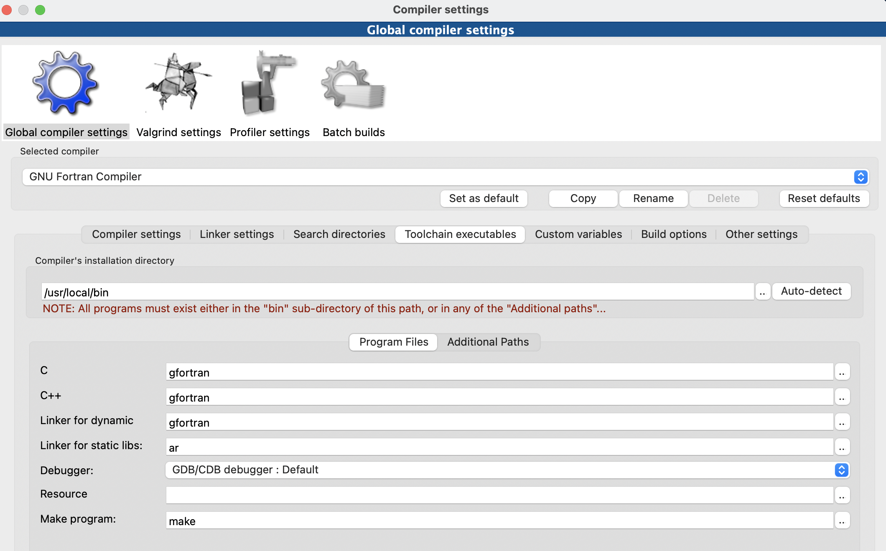
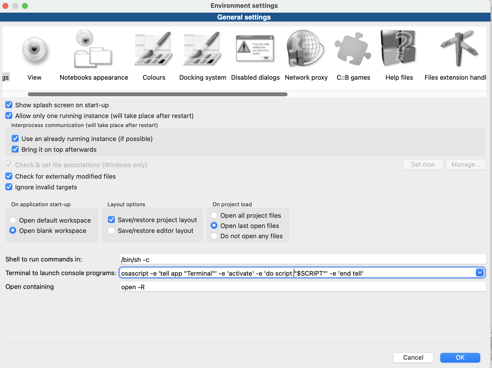

Fortran语言已经是上世纪的产物了，现在越来越多的人都不接触Fortran语言了。但是话说回来，很多数值计算的书和代码都用到了Fortran语言，尤其是比较老的书籍和代码，所以说不懂得Fortran语言是学习路上的一大阻碍。

本教程主要是完成CodeBlocks+Fortran配置，使得您的电脑能够运行Fortran语言。CodeBlocks想必大家已经很熟悉了，是一款轻量级的IDE，而且是开源的，还是多平台的，能够很好地支持C/C++以及Fortran。CodeBlocks目前的版本的是[20.23](https://github.com/HyungJu/code-blocks-mac/releases/download/20.03/CodeBlocks.20.03.for.macOS.dmg)，我用的是Mac系统，目前使用的是[17.12](https://mac.filehorse.com/download-code-blocks/download/)的版本，官网对Mac系统目前只有10.XX的版本好像，可以点击我的链接下载两个版本。

对与Fortran编译器，种类繁多，比较流行的就是我用的gfortran，对Mac系统的用户比较友好。本篇教程是以Mac为示范，对其他系统仍有参考意义。

第一步，从App Store下载Xcode软件。然后安装命令行工具，打开终端输入：
```
xcode-select --install
```


第二步，安装Homebrew（这个是什么，可以百度了解一下），打开终端输入：
```
/bin/bash -c "$(curl -fsSL https://raw.githubusercontent.com/Homebrew/install/HEAD/install.sh)"
```
注意，安装速度比较慢的话，建议去搜一下镜像安装链接。
安装完成后，继续输入以下指令：
```
brew update
brew install gcc
```
这是在安装gcc，因为gfortran是包括在gcc里面的。
安装完成后，可以输入指令
```
which gfortran
```
如果返回文件地址，则说明安装成功。注意，这个地址后面要用到。

第三步，配置CodeBlocks。打开CodeBlocks后，新建一个(fortran application) project，打开setting，修改complier，如下

```{r, echo=FALSE, out.width="100%", fig.align="center"}

```
注意那个地址就是上面提到的。

第四步，配置终端。输出是在终端，但Mac终端输出的却很奇怪，不是你想要的，你需要做如下修改，打开setting > Environments，把下面的 Terminal to launch console programs修改成图片样子即可。

```{r, echo=FALSE, out.width="100%", fig.align="center"}

```

如此一来，你就可以畅快地在你的CodeBlocks上运行着Fortran语言啦。


