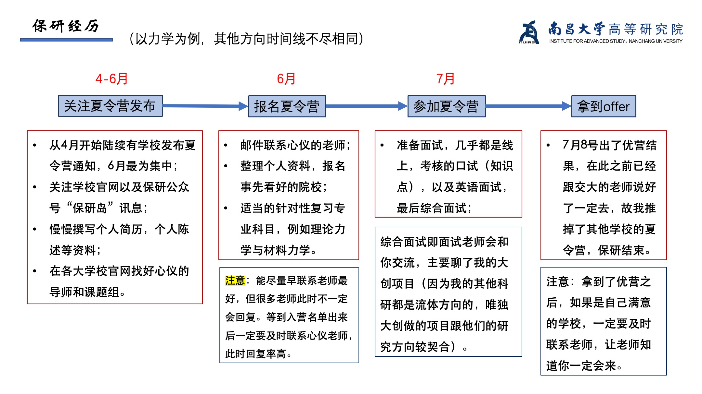
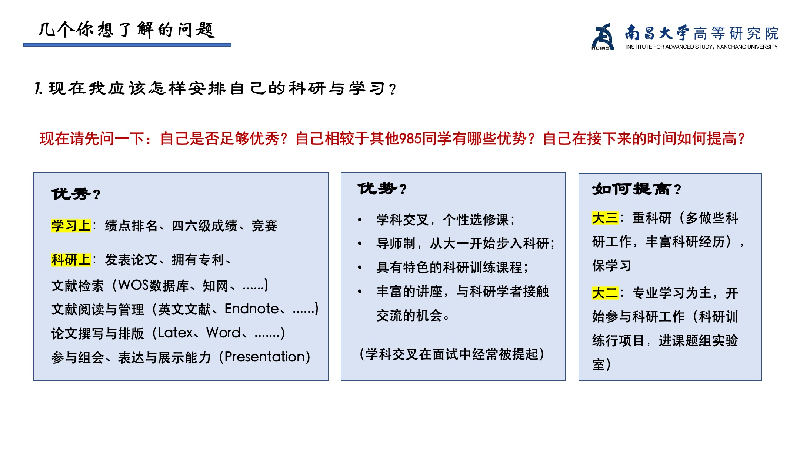
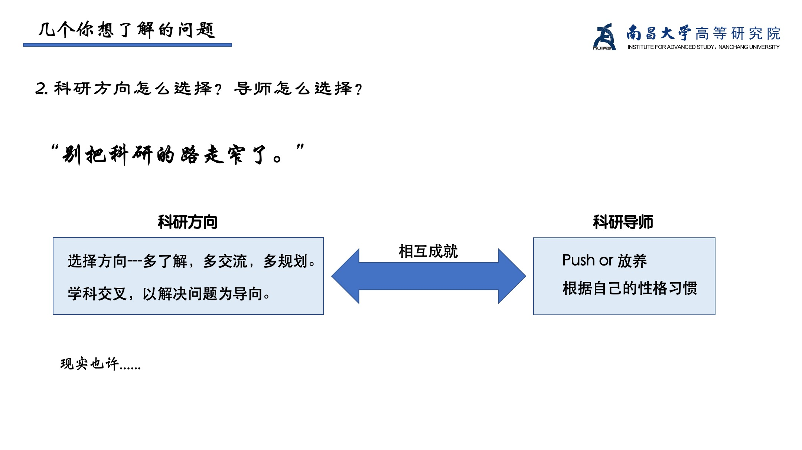
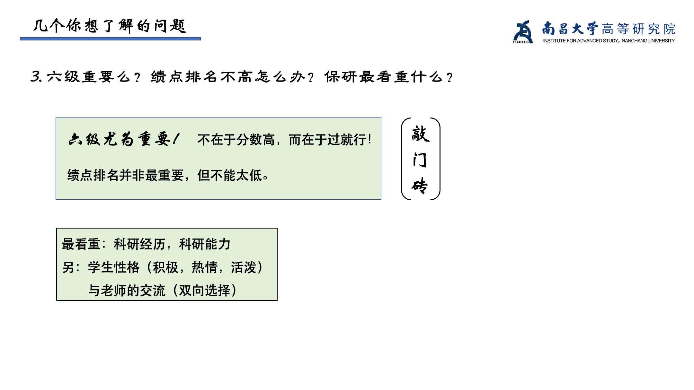
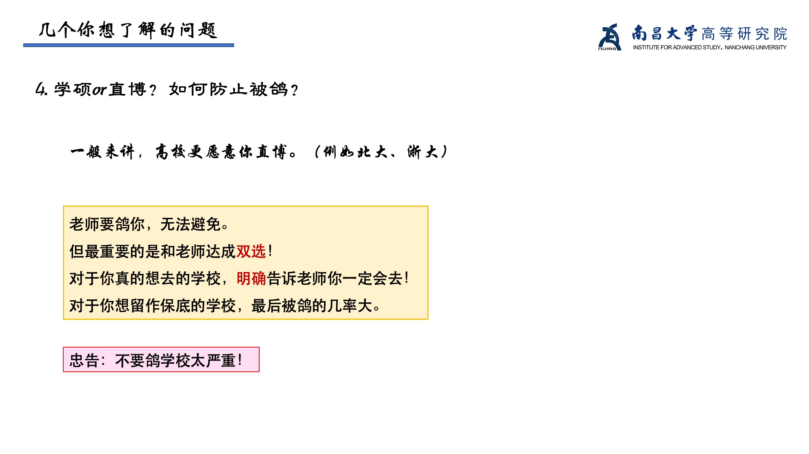
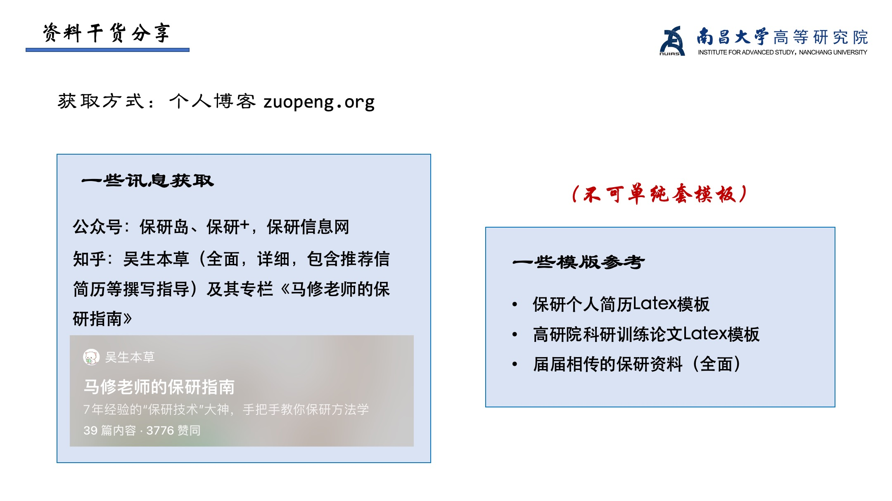
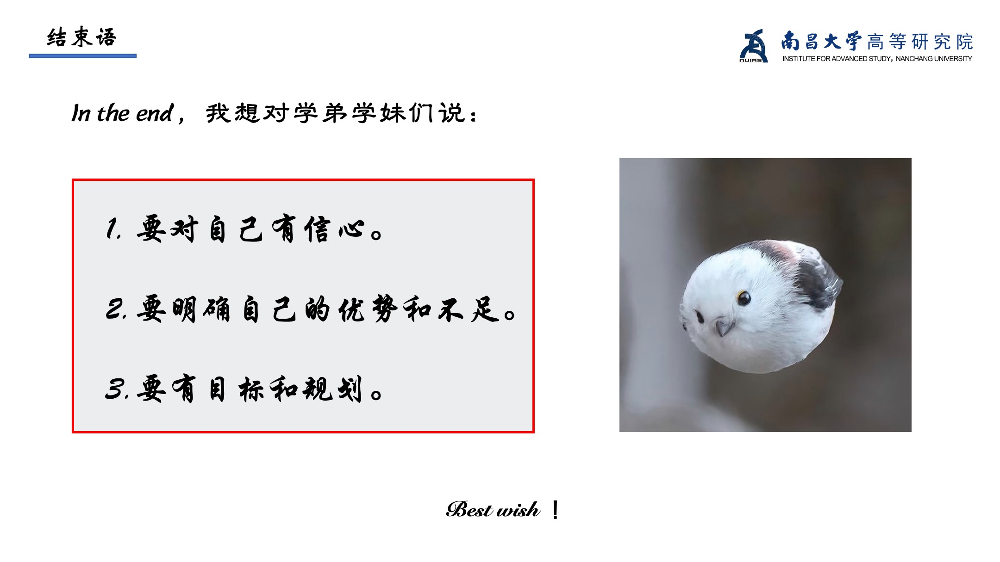

一年又一年，时光飞逝。每年保研交流会的开场白都是“很荣幸站在这里，去年我也像你们一样坐在下面听着学长学姐们的分享，一晃今年轮到我站在这里和你们分享”，今年轮到我了。

我分享的资料有两份[Latex模板](https://pan.baidu.com/s/1hNlgzgM5P4BKW82zYUfYfg?pwd=0000)（提取码：0000），以及一份届届相传的[保研资料](https://pan.baidu.com/s/1g-ilhdpG_o72P0yFpODChw?pwd=0000)（提取码：0000）可供参考。那就祝大家保研顺利啦！

以下是我本次交流会ppt的主要内容:
```{r, echo=FALSE, out.width="100%", fig.align="center"}

```
```{r, echo=FALSE, out.width="100%", fig.align="center"}

```
```{r, echo=FALSE, out.width="100%", fig.align="center"}

```
```{r, echo=FALSE, out.width="100%", fig.align="center"}

```
```{r, echo=FALSE, out.width="100%", fig.align="center"}

```
```{r, echo=FALSE, out.width="100%", fig.align="center"}

```
```{r, echo=FALSE, out.width="100%", fig.align="center"}

```


